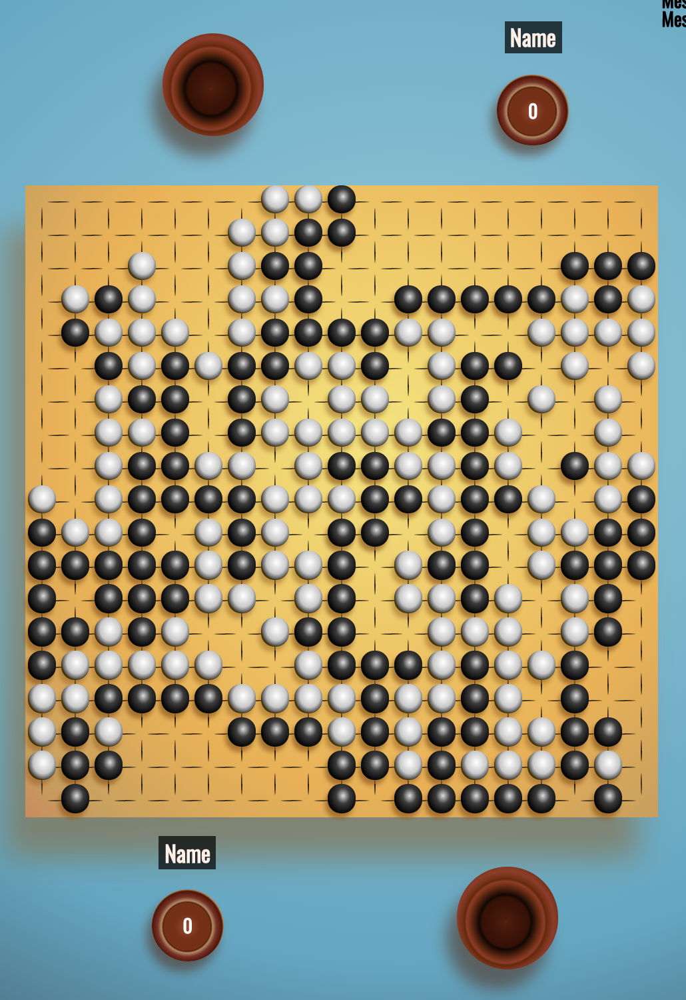
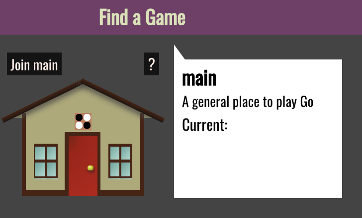

# Node Go
A browser application to play Go in real time.

[The project in it's current state](https://play-node-go.herokuapp.com/)  
[Client only prototype](https://sorrelbri.github.io/browser-go-proto/)



[About Go](#the-game-of-go)  
[Technical Challenges](#technical-challenges)  
[Setup For Development](#setup)  
[Known Bugs](#known-bugs)  
[Roadmap](#roadmap)  
[Features](#features)  
[Tech](#built-with)  

---
## The Game of Go
Go is a 2 player abstract strategy game of perfect information.

Players take turns placing playing pieces called stones on the intersections of a gridded board. This board is usually a square 19 points across. Stones remain on the points at which they are placed unless they are captured by the opposing player. Capture occurs when a stone or group of stones no longer has any adjascent empty points.

Play ends when both players agree that they have exhausted all advantageous moves. Scoring is determined by counting and comparing the area controlled by either player.

For a more detailed explanation of the rules, please see [my previous illustrated explanation of the game of go](https://github.com/sorrelbri/browser-go-proto#the-game-of-go) or the [American Go Association's Concise Rules of Go.](https://www.usgo.org/aga-concise-rules-go)

---
## Technical Challenges
### Modeling Game State
A go board typically consists of 361 points which can exist in a number of states.

### Partitioning Game Rooms
Finding a game starts with joining a game room.

Watch an in progress game, join a game, or study a historic game.


---
## Setup
### Local Repo
```sh
$ git clone https://github.com/sorrelbri/node-go.git
```

### Install Deps
```sh
$ npm run bootstrap
```  
Runs lerna `bootstrap` command installing dependencies for project, development and package dependencies

### Initialize Database
#### Download PostgreSQL 
To verify PostgreSQL installation:  
```sh
$ psql -V
```
Node Go API was built with version 11.4.
[See documentation for Postgres download.](https://www.postgresql.org/download/)

#### Create Databases
```sh
$ psql
# psql(11.4)
```
```sql
CREATE DATABASE node-go;
CREATE DATABASE node-go-test; # testing database
```

### Configure Environment
```sh
$ touch packages/server/.env
```

```
# .env
NODE_ENV=development
PORT=# set development port for API
REACT_ADDRESS=http://localhost:3000 # default
PG_CONNECTION_STRING=postgresql://localhost:5432/node-go
PG_CONNECTION_STRING_TEST=postgresql://localhost:5432/node-go-test
JWT_SECRET=# generate a secret key for JWT signing algorithm
TEST_SECRET=# same as above, for test environment
SALT_ROUNDS=# set number of salt rounds for bcrypt hashing function
DOMAIN=localhost
USER_ONE_PASSWORD=# credentials for testing with 
USER_ONE_EMAIL=# same as above
```

### Smoke test
```sh
$ lerna run test
```

### Run Database Migrations
```sh
$ cd packages/server; npm run migrate; npm run seed
```

### Running in development
```sh
$ cd packages/server
$ npm start # or if you have nodemon
$ nodemon
```
```sh
$ cd packages/play-node-go
$ npm start
```

---
## Known Bugs
- game end logic not implemented on front end yet
- no authorization for game moves
- websocket connections may remain open, pooling prevents runaway leaks, but tests may hang

---
## Roadmap 
### 6/20
1. Frontend implementation of game end logic
2. Auth for games
3. Game request creation
### 7/20
1. Generate game records
2. Implement chat
3. Implement study mode

---
## Features
- [x] Realtime play
- [x] Account authentication
- [ ] Chat
- [ ] Study mode
- [ ] Multiple game settings
- [ ] Customizable board size
- [ ] Download games in .sgf format

---
## Built with
- [Express](https://expressjs.com)
- [React](https://reactjs.org)
- [PostgreSQL](https://postgresql.org)
- [Socket.io](https://socket.io)
- [Sass](https://sass-lang.com)
### Management & Deployment
- Lerna
- CircleCI